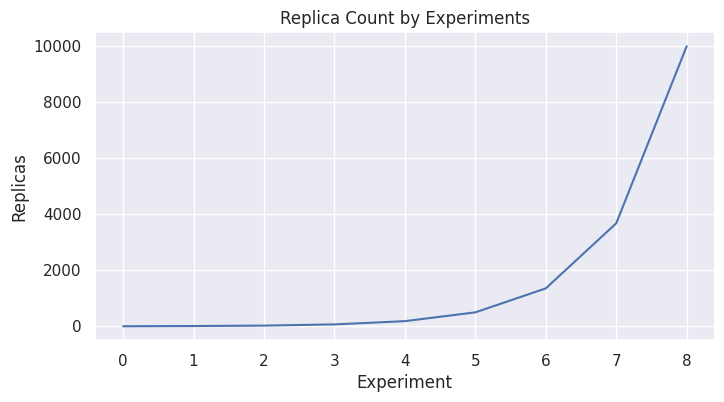

# Kubernetes Federation Experiments
This repository holds python script and documentation for measuring performance of different federation frameworks of kubernetes. 

# Frameworks
Here different federation frameworks and their official descriptions are given. The performance measurements will be done for each of the given frameworks.

## Native Kubernetes
Kubernetes, also known as K8s, is an open source system for managing containerized applications across multiple hosts. It provides basic mechanisms for deployment, maintenance, and scaling of applications.

For more info refer [here](https://github.com/kubernetes/kubernetes)

## KubeFed
Kubernetes Cluster Federation (KubeFed for short) allows you to coordinate the configuration of multiple Kubernetes clusters from a single set of APIs in a hosting cluster.

For more info refer [here](https://github.com/kubernetes-sigs/kubefed).

## Liqo
Liqo is an open-source project that enables dynamic and seamless Kubernetes multi-cluster topologies, supporting heterogeneous on-premise, cloud and edge infrastructures.

For more info refer [here](https://github.com/liqotech/liqo).

## EdgeNet
EdgeNet is Kubernetes adapted for the network edge. It allows you to deploy applications to hundreds of nodes that are scattered across the internet, rather than to just one or a small number of centralized datacenters.

For more info refer [here](https://github.com/EdgeNet-project/edgenet)

# Experiment Structure
The goal of the experiments is to measure the performance of different federation implementations with different number of workloads. Note that we are only interested in performance of the orchestration tools. Thus we will use a [busybox]() which is a lightweight deployment.

The container image for the deployments will be fulled beforehand.

Each measurement will take place 8 times to reduce the standard deviation.

For each framework and there will be different number of replicas used. These replicas will start from 1 and increase exponentially. This graph can be seen in the figure below.

